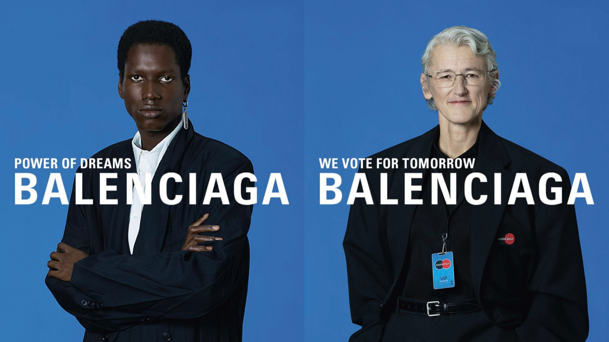

# Balenciaga Spring 2020

  

## Background history
A brand created by `Cristóbal Balenciaga`, who was born in Spanish then moved to Paris, with over 100 years of history.

## About
`Demna Gvasalia`
- current creative director of Balenciaga
- the co-founder of Vetements
- born under the context of the Soviet Union
- studies economics during college

## Motif
- `Futurism`: a social ideology that studies and extrapolates the progression of the society based on the status quo. From the aspect of designing, futurism is demonstrated by criticizing and negate dated ideology.
- `Youth, Speed, Power, and Technology`

## Details to know about
- ### Stage
Resemble the conference room of European Nation with the classic blue: the untenable and broken utopia caused by conflicts between nations due to covid19
- ### Atmosphere 
Spiral shaped stages and pathways: the downward spiral that everyone experiences
- ### Models
Not just professional models, professionals from different realms are included - we are all social animals after all
- ### Thoughtful elements
  - `power dressing for women`
    - implies how politics manipulate people.
  - `replacing identification card with Master Card`
    - represents modern people’s misconception of self-identification and security which is now just built upon purchasing power.
  - `models holding smart phones`
    - questions viewer whether is technology owns us or we own technology?
  - `coats covered with gossip magzines`
    - resembles the impetuosity in society
  - `blades representing drug culture`
    - express the corruption of youth

## What is the show trying to express?
As a designer with multicultural backgrounds, Demna is much more sensitive to elements that are outside of design art. Lets first take a look at these two quotes from him:
 - `I like that people think my clothes are ugly. I think it is a compliment.`
 - `I think it’s also very interesting to find this line where ugly becomes beautiful and beautiful becomes ugly.`
 
Demna wants people to view ugliness before recognizing what is actually beauty by challenging the viewer with visually striking elements in his design. By having these abnormal and challenging elements, the designer does not only want to challenge modern aesthetics, but he also wants to people to reflect on the current society. The designer is trying to convey the necessity to pay attention to youth and also to reflect on technology.
